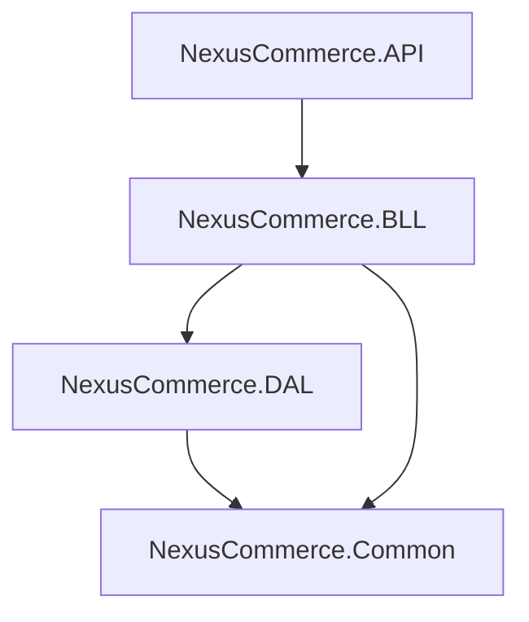

# NexusCommerce API

NexusCommerce is a robust, production-ready E-Commerce REST API built using **ASP.NET Core (.NET 10.0)**, **Entity Framework Core (SQL Server)**, and **Microsoft Identity**. It follows a clean N-tier architectural pattern (Separation of Concerns) ensuring high maintainability, testability, and scalability.

---

## 🚀 Features

*   **Authentication & Security**: ASP.NET Core Identity with secure **JWT Bearer Token** authentication, password hashing, and role-based policies (`Admin` vs. `Customer`).
*   **Product Catalog**:
    *   Dynamic searching (partial case-insensitive matching).
    *   Filtering by category.
    *   Sorting (by price, name, etc.).
    *   Highly optimized cursor/offset pagination.
*   **Shopping Cart**:
    *   Automatic cart creation upon customer registration.
    *   Real-time stock level validation.
    *   Add, edit, quantity increment/decrement, and remove operations.
*   **Order Checkout**:
    *   Secure checkout process.
    *   Atomically deducts product stock.
    *   Clears user's cart post-purchase.
*   **Image Management**: File upload system mapping local storage directories to static file requests (`/Files`).
*   **Interactive API Docs**: Built-in interactive **Scalar API Reference** (a modern Swagger/OpenAPI alternative).

---

## 🏗️ Architecture Layers

The solution is divided into four main layers following clean coding conventions:



1.  **`NexusCommerce.API` (Presentation)**:
    *   Endpoints/Controllers.
    *   Middleware configuration (Identity, JWT validation, CORS, Static Files).
    *   OpenAPI / Scalar API Reference generation.
2.  **`NexusCommerce.BLL` (Business Logic)**:
    *   **Managers** orchestrating core workflows (e.g., `AuthManager`, `CartManager`, `ProductManager`).
    *   Request models / DTOs.
    *   Data mapping profiles using **AutoMapper**.
    *   Request validations using **FluentValidation**.
3.  **`NexusCommerce.DAL` (Data Access)**:
    *   `AppDbContext` mapping SQL databases with automatic timestamp tracking (`IAuditable`).
    *   Fluent API database configurations and relationships.
    *   **Repository Pattern & Unit of Work Pattern** decoupling SQL queries.
    *   Default data seeder (`SeedDataProvider`).
4.  **`NexusCommerce.Common` (Utilities)**:
    *   Clean standard result patterns (`GeneralResult` / `Errors` objects).
    *   Pagination parameters and metadata wrappers.

---

## 🛠️ Technology Stack

*   **Runtime**: .NET 10.0
*   **Database**: SQL Server (LocalDB support configured)
*   **OR/M**: Entity Framework Core 10.0
*   **Auth**: Microsoft Identity Core & JwtBearer
*   **Mapping**: AutoMapper
*   **Validation**: FluentValidation
*   **Documentation**: Scalar API Reference / Microsoft OpenApi

---

## ⚙️ Getting Started

### Prerequisites

*   [.NET 10.0 SDK](https://dotnet.microsoft.com/download/dotnet/10.0)
*   LocalDB or SQL Server Express installed and running.

### 1. Connection Configuration

Open the `appsettings.json` (or `appsettings.Development.json`) in **`NexusCommerce.API`** and configure your connection string:

```json
{
  "ConnectionStrings": {
    "DefaultConnection": "Server=(localdb)\\mssqllocaldb;Database=NexusCommerceDb;Trusted_Connection=True;MultipleActiveResultSets=true"
  }
}
```

### 2. Apply Database Migrations

Run the following command in the solution directory to create the database schema:

```bash
dotnet ef database update --project NexusCommerce.DAL --startup-project NexusCommerce.API
```

### 3. Run the Application

Start the Web API server:

```bash
dotnet run --project NexusCommerce.API
```

---

## 📑 API Documentation (Scalar)

Once the application is running, navigate to:
🔗 **`https://localhost:7081/scalar/`**

Here you can view, interact with, and test all active endpoints directly from the browser.

---

## 🔑 Default Seed Data

For manual testing, the database automatically seeds default roles and accounts at startup:

| Account Type | Email | Password | Role |
| :--- | :--- | :--- | :--- |
| **Admin** | `admin@nexus.com` | `Admin123!` | Admin |
| **Customer** | `customer@nexus.com` | `Customer123!` | Customer |

---

## 🔒 Request Authentication Flow

To access authenticated endpoints (e.g., Cart and Orders):

1.  Send a `POST` request to `/api/auth/login` with your credentials.
2.  Copy the returned `token` string from the JSON response.
3.  Add the `Authorization` header to your subsequent HTTP requests:
    *   **Key**: `Authorization`
    *   **Value**: `Bearer <paste_copied_token>`

